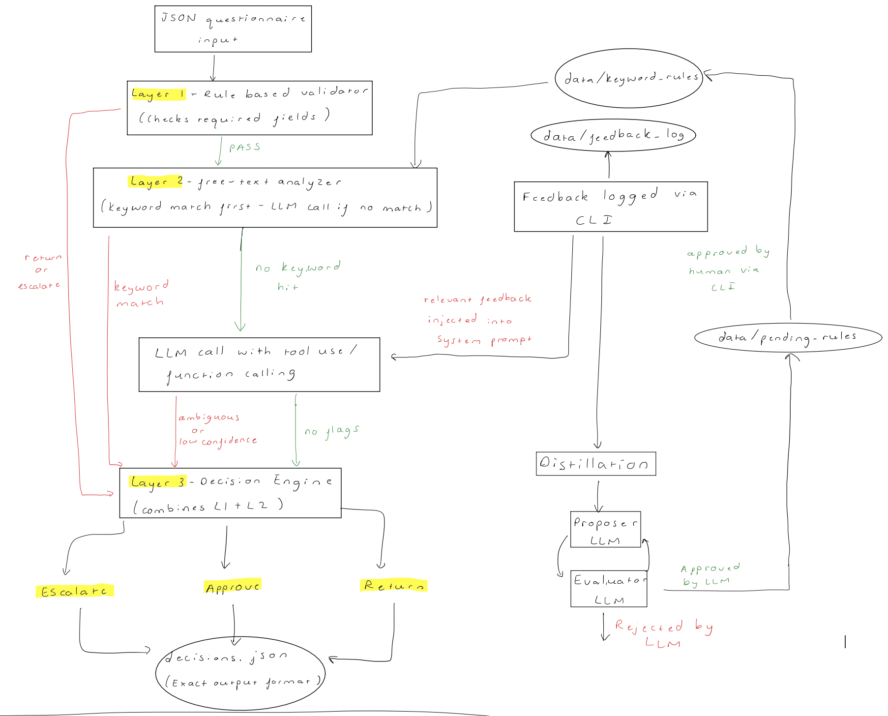

# PE-Fund-Agent

## Overview 
This repository contains a prototype AI agent system capable of processing PE fund subscription questionnaires. Based on the content and structure of each questionnaire the agent either: 
- Approves
- Returns
- Escalates to Human Review 

My agent has taken a 3 layer approach to the problem, also including a 2 step learning mechanism to allow the agent to improve over time with human oversight. A basic overview of the 3 layers: 
1. Layer 1 - Validation
2. Layer 2 - Analysis
3. Layer 3 - Decision Engine

Learning Mechanism/Feedback Loop 

Please find a more detailed description of my architecture, design choices, decision logic and learning mechanism below. Hope you enjoy using my agent! 

## Setup

### Prerequisites

- Python 3.10 or higher
- An [Anthropic API key](https://console.anthropic.com/) **(Vega Team - I can provide you with my API key if you use a different provider)**

### Installation

1. Clone the repository or unzip the provided archive:

```bash
git clone https://github.com/shivamsangani/PE-Fund-Agent
cd PE-Fund-Agent
```

2. Install dependencies:

```bash
pip install -r requirements.txt
```

3. Create a `.env` file in the project root and add your API key:

```bash
cp .env.example .env
```

Then open `.env` and set:

```
ANTHROPIC_API_KEY=your_key_here
```

## Running the Agent

### Process questionnaires

Run the agent against an input file and write decisions to an output file:

```bash
python3 main.py run --input data/questionnaires.json --output output/decisions.json
```

Both flags default to the above paths, so this is equivalent:

```bash
python3 main.py run
```

**Mock mode** (Run a version with no API calls (no API key required) - skips the LLM call, but Layer 1 still runs):

```bash
python3 main.py run --mock
```

### Submit a human correction

If a compliance officer disagrees with a decision, log the correction and trigger the learning pipeline:

```bash
python3 main.py feedback --id <questionnaire_id> --human-decision <Approve|Return|Escalate> --reason "Your reason here"
```

This logs the correction to `data/feedback_log.json`. If the human decision differs from the agent's, the distillation pipeline automatically proposes a new keyword rule for review.

### Review and approve distilled rules

After corrections are logged, review any auto-proposed keyword rules:

```bash
python3 main.py approve-rules
```

You will be shown each proposed keyword, the evaluator's reasoning, and the source case. Approved keywords are added to `data/keyword_rules.json` and will be applied on the next run.

For more information on flags and the CLI, please run: 
```bash
python3 main.py <run|feedback|approve-rules> -h
```

## Architecture and Design Choices
As mentioned above, my architecture is divided into 3 key layers + a feedback mechanism, summarised in this diagram:
 
### 1. Validation (agent/validator.py)
This layer runs first on any questionnaire and performs deterministic checks on the basic review criteria outlined in the brief. It checks all required fields for null/missing values, however it also performs extra checks on the fields `signature_present` (must be true),`tax_id_provided` (must be true),`investment_amount` (must be > 0) which cause the questionnaire to be returned. <br>

If there are any missing fields, the agent outputs the **Return** (actionable - investor can fix and resubmit). However if `is_accredited_investor` is false, the agent outputs **Escalate** (not fixable by resubmission, needs human review). If everything passes then the questionnaire gets passed to Layer 2 (Analysis). <br>

There is also extra checks in this file for the types of each field - if the field types do not match, a Return is initiated

The output of this layer is a list of missing/failed fields (if needed), a pass/fail flag and a escalation flag stored in a JSON. For example: 
```json 
{
    "passed": False,
    "missing_fields": ["investor_address", "tax_id_provided"],
    "escalate": False,
    "escalation_reason": None
}
```
**Design Choices**
- Running deterministic checks first means the LLM is never called on incomplete records. This saves cost, time and avoids the LLM hallucinating assessments on null fields
- Return takes priority over Escalate - if fields are missing AND the investor is non-accredited, returning is more actionable since the compliance team cannot review an incomplete submission anyways. 
- This layer does not assess the *quality* of the field values - handled by Layer 2. This enables a each layer to be fully deterministic or a hybrid between rule-based and ML handling. 

### 2. Analysis/Handling Ambiguity (agent/analyser.py)
This layer runs a two-stage analysis (keyword-matching, LLM call) of the two free-text fields in the questionnaire: `source_of_funds_description` and `accreditation_details`. This layer only runs if Layer 1 passes - this means that it is never called on incomplete records

1. Keyword Matching - The agent checks both fields against a known list of known red-flag phrases in `data/keyword_rules.json`. It performs case-insensitive, whole phrase matching so that the longer phrases match before their substrings (e.g. "intermediary entities" matches before "intermediary") and case does not affect the match. This stage involves 0 API cost and is instant - if a keyword is matched, Layer 3 (Decision) is called immediately without making any LLM calls

2. LLM Assessment - This only runs if no keywords are matched in the specific fields. I've used Claude Haiku with `temperature=0` to minimise variance in the output. Also, during this stage I forced structured output via tool use - the model must call the tool I've defined to output a structured JSON with the format shown below: 
```json
{
    "source_of_funds_assessment": "ambiguous",
    "accreditation_assessment": "clear",
    "escalation_reason": "Vague source description lacks verifiable detail",
    "confidence": 81
}
```
In this stage, tool use is preferred over prompt engineering a JSON because it guarantees format compliance - The API rejects responses that don't match. I've also added an confidence score to each JSON, if `confidence<75`, escalation is triggered no matter the assessment as you would rather be safe in uncertain cases. Also, if the model doesn't return a tool call at all, I added a fail-safe which escalates to human review. <br>
**Learning Mechanism**
- Finally, up to 3 few-shot examples from the feedback log are injected into the system prompt at runtime if the LLM is called, this allows the model to learn from past human corrections without retraining the model completely.
- This prompt engineering is much faster and more flexible than retraining a model completely, if also incorporated with RAG (so that the model can retrieve previous rejected/accepted questionnaires from AltOS' record) it allows for a much more adaptable system. 
- Only if a ceiling is hit with Prompt Engineering + RAG can we consider fine-tuning a model for these purposes which is more expensive and takes more time. 

**Design Choices**
I have adopted a hybrid system of keyword matching and a LLM for a few reasons: 
- Keywords only cannot catch niche phrasing, e.g. "structured financial arrangements and cross-border capital reallocation" contains no flagged keywords but is clearly suspicious. With no LLM, a human would need to review this, the LLM catches it where static rules cannot. 
- However LLM's are also probabilistic - a keyword that has been confirmed should always be escalated not depend on the confidence of the model to catch it
- Cost and Latency - keyword matching is free and instant, whereas LLM calls are not

Hence the hybrid system makes sense as the two stages complement each other: keywords catch known words/phrases reliably, LLM handles more ambiguous cases 

### 3. Decision Engine/Decision Logic (agent/decision.py)
This layer assembles the final decision (Approve, Return, Escalate) with any other associated fields (`missing_fields`, `escalation_reason`) from the outputs of Layer 1 and Layer 2. The file is a single function with no LLM calls and no dependencies - it is purely deterministic. The decision follows a strict priority order (first condition matches, wins): 
    1. Missing/invalid required fields -> Return
    2. Non-accredited investor -> Escalate 
    3. Keyword match in free text -> Escalate
    4. LLM flags ambiguous or concerning -> Escalate
    5. LLM confidence < 75 -> Escalate
    6. All clear -> Approve

**Design Choices**
- I made the assumption that a Returned questionnaire takes priority over an Escalated one. If a record has missing fields and a non-accredited investor, returning is more actionable - it allows the investor to fix their mistakes. A compliance officer cannot meaningfully review an incomplete submission and it also allows time for the compliance officer to focus on more important cases (e.g. a completed form with suspicious fields flagged in Layer 2)
- I've kept the decision logic fully separate from the validation + analysis logic. This makes the priority order explicit in one file which allows for easier auditing rather than buried in other validation + analysis
- With this architecture, it easy to change the priority order depending on a particular company's choices without touching Layer 1 and Layer 2 

Finally after this layer, the pipeline is complete, and decision.py returns this output schema as specified: 
```json
{
  "questionnaire_id": "...",
  "decision": "Approve | Return | Escalate",
  "missing_fields": ["field1", "field2"] | null,
  "escalation_reason": "..." | null
}
```

## Learning Mechanism (More Detailed)
I managed to implement a full learning mechanism that allows the agent to improve with human oversight. Similar to Layer 2, I implemented it with two complementary mechanisms: few-shot injection (immediate) and rules distillation (persistent, affects future runs). All learning happens with human oversight - nothing is applied automatically, this keeps the human in the loop. 

A compliance officer submits a correction via `python3 main.py feedback`, this is logged to `data/feedback_log.json` with the: two free text fields, agent decision, human decision, human reason and timestamp. The distillation process is only triggered if the agent decision differs from the human decision. 

**Security** - PII is never stored in the `feedback_logs.json`, it is deliberately excluded. 

**Explanation + Design Choices** <br>
1. Few-shot injection - On every Layer 2 LLM call, the agent retrieves the 3 most similar past corrections from the feedback log. Similarity is computed using `difflib.SequenceMatcher` on the source + accreditation text. These similar corrections are injected into the system prompt so the model sees: what was submitted, what the agent decided, what the human overrode and why
    - I decided to use this library instead of embedding the text as I believe this is a future extension given more time, it also is a quicker process. 
    - The effect is immediate - the next run after a logged correction already benefits from it, with no retraining required 

2. Rules distillation - I use a two LLM proposer-evaluator pattern to propose new keywords to be added to the current rules based on logged corrections. 
    -Proposer - Given the correction context, proposes a keyword or phrase that could catch similar cases 
    -Evaluator - Given the proposed keyword and existing list, checks for specificity, redundancy, and usefulness. Also rejects with a reason and rejects if the keyword already exists in the current rules
    -This pattern reduces low-quality output from entering the keywords list - a single model generating and approving would be unreliable
    -Approved rules still need to be further examined and improved by a human. A human compliance officier runs `python3 main.py approve-rules` to review each proposal before its added to the final keyword list

**Human in the Loop Design** - No correction, distilled rule or proposed keyword ever affects the live system without a human approving it. The agent can learn and propose but not self-modify. This is intentional for a compliance context where false positives can have an impact.   

## Security Decisions
Several security assumptions were made about the threat model and data handling requirements. These shaped architectural decisions: 
- **Untrusted Input** - The free text fields are treated as untrusted user input. An intruder could embed prompt injection instructions alongside these fields (a hidden instruction to override the agent's behaviour or output fake assessments). This is addressed in 2 ways: the LLM is never shown the raw text fields without a structured prompt boundary (system prompt is separate from user prompt), and forced structured output via tool use means the model can only return a predefined JSON schema (output guardrail). This limits what a successful injection could do even if it got through 
- **The questionnaire fields include PII** - The `feedback_log.json` deliberately excludes all PII - only the two free-text assessment fields, decisions, and reasons are stored. This means that a log compromise does not expose investor identity data. As an extension this could lead to field level encryption (AES-256), TLS in transit for API calls and tokenisation of PII fields before an LLM call 
- **Principle of least privilege** - Each layer only has access to what it needs. Layer 2 only passes the two relevant free-text fields not the full record - the LLM is never given the investor's name, tax ID, or investment amount. This limits the damage if the model were to leak context, it was never given the full investor record 
- **LLM should not be called on incomplete records** - Running the LLM on null or missing fields risks hallucination - Layer 1 acting as a hard gate before any LLM call addresses this directly. 

## Assumptions

- Input is a JSON array of flat objects — no nested structures are handled
- `questionnaire_id` is always present and unique across records
- `submission_date` is informational only and is not validated
- `signature_present: false` and `tax_id_provided: false` are treated as missing fields since they are boolean compliance flags, not just absent data
- `investment_amount` of zero is treated as invalid, not just null
- Return takes priority over Escalate when both conditions are met — missing fields should be resolved before escalation is meaningful
- Non-accredited investors are always escalated — the brief said "generally escalated", this is treated as a hard rule
- A confidence threshold of 75 is the appropriate cutoff for requiring human review
- 3 few-shot examples provides sufficient context without overloading the prompt
- Only corrections where the human and agent disagree are worth distilling into rules

## Known Limitations

- **Keyword matching is exact** — a red-flag phrase that is paraphrased or misspelled will not be caught by Stage 1 and must rely on the LLM
- **Few-shot similarity is text-based** — `difflib.SequenceMatcher` compares character sequences, not semantic meaning. Two corrections about the same concept worded differently may score low similarity and not be retrieved
- **No confidence calibration** — the 75 confidence threshold is fixed. There is no mechanism to track whether records in the 75–85 band are being overridden frequently, which would indicate the threshold is too low
- **Distillation proposes one keyword per correction** — the pipeline extracts a single phrase from each correction. It cannot identify broader patterns across multiple corrections
- **Feedback log grows unboundedly** — there is no archiving or pruning mechanism. Over time, old corrections from outdated compliance policies will still be retrieved as few-shot examples
- **Single-provider dependency** — Layer 2 and distillation are coupled to the Anthropic SDK. Switching providers requires changes in `analyser.py` and `distillation.py`
- **Prototype scale only** — processes records sequentially in a single process. Not suitable for high-volume batch processing without parallelisation

